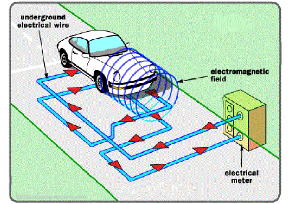
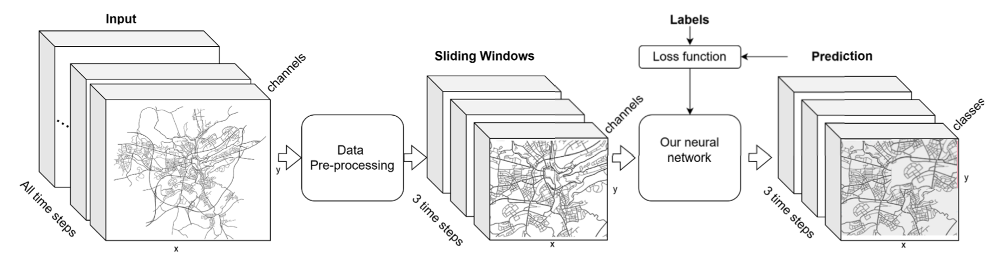
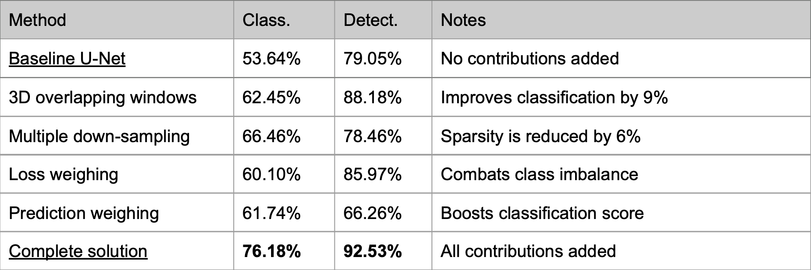
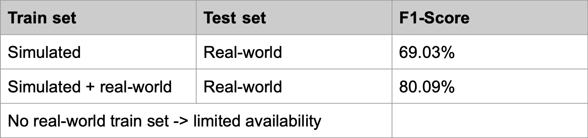

# Detecting and Classifying Traffic Rule Changes from Induction Loop Data

**Deep learning for smart city map maintenance: detecting road blockages and traffic sign changes from urban sensor data - without cameras or GPS traces.**

📄 Published paper: [IEEE Xplore](https://doi.org/10.1109/BigData59044.2023.10386419) · *Proceedings of the 2023 IEEE International Conference on Big Data (BigData 2023)*


---

## Overview

Keeping digital road maps accurate for navigation apps, autonomous vehicles, and smart city systems usually depends on expensive methods like satellite imagery or street-view cameras. This project explores a cheaper, privacy-preserving alternative: using existing **induction loop sensors** (already embedded in roads for traffic management) to automatically detect and classify changes in traffic rules.

We designed a deep learning pipeline (based on a modified U-Net with spatio-temporal components) that takes in city-wide traffic flow data (vehicle speed and road occupancy) and predicts:
- Road or lane blockages
- Speed limit changes
- New turn restrictions (left, right, U-turn, straight-only)

The model was evaluated on both simulated (SUMO/LuST, Luxembourg) and real-world (HERE Traffic API) data, achieving F1-scores above 80% in detection and over 75% in multi-class classification, despite challenges like sparse sensor coverage, high-dimensional input, and severe class imbalance.

## Why this matters

- **Cost-effective**: no need for camera fleets or manual surveying, induction loops are already deployed in most cities
- **Privacy-preserving**: unlike GPS traces from taxis/buses, this approach doesn't track individual vehicles
- **Applicable to**: autonomous driving map maintenance, smart city infrastructure monitoring, urban traffic anomaly detection, digital twin systems

## Method overview
 <br>
*Illustration of how induction loops detect passing or stationary vehicles.*

 
*Sliding‑window data processing and prediction workflow.*

## Pseudocode

For a structural walkthrough of the pipeline from tensor 
construction through the loss function, see 
[`code/pseudocode.md`](code/pseudocode.md).

<details>
<summary>Quick preview</summary>

1. Input tensor construction
2. Multi-pooling down-sampling
3. 3D overlapping sliding windows + augmentation
4. Model: 3D U-Net + stateful ConvLSTM + residual connections
5. Class-imbalance-aware weighted loss
6. Confidence-weighted prediction aggregation

</details>

## Minimal Demo

A small, from-scratch PyTorch demo [`code/demo_convlstm_synthetic.py`](code/demo_convlstm_synthetic.py) 
illustrating the ConvLSTM-based spatio-temporal detection idea from 
the paper, trained on synthetic data. **Not** the original 
implementation or dataset - see the file's docstring for details.

## Key results

Experiments on simulated data 



Experiments on real-world data 



Achieved F1‑scores above 80% in detection and over 75% in multi‑class classification, validated on both simulated (SUMO/LuST, Luxembourg) and real‑world (HERE Traffic API) datasets.


## Research Talk Slides
To make the paper more accessible, here are slides from an internal lab presentation summarizing the work: 
[Download Full Slides (PDF)](slides/presentation.pdf)

## Citation

If you find this work useful, please cite:

### BIBTEX
```bibtex
@inproceedings{zhanabatyrova2023detecting,
  title={Detecting and Classifying Changes in Traffic Rules using Induction Loop Data},
  author={Zhanabatyrova, Aziza and Leite, Clayton and Xiao, Yu},
  booktitle={2023 IEEE International Conference on Big Data (BigData)},
  pages={1248--1255},
  year={2023},
  organization={IEEE}
}
```
### APA
```apa
Zhanabatyrova, A., Leite, C., & Xiao, Y. (2023, December). Detecting and Classifying Changes in Traffic Rules using Induction Loop Data. In 2023 IEEE International Conference on Big Data (BigData) (pp. 1248-1255). IEEE.
```

## Keywords

`traffic anomaly detection` `change detection` `IoT` `deep learning` `U-Net` `ConvLSTM` `spatio-temporal data` `smart city` ` `urban sensing` `induction loop sensors` `traffic sign detection` `digital map maintenance` `map updating` `autonomous driving` `HD maps` `intelligent transportation systems` `traffic flow prediction` `class imbalance` `tensor-based learning` `SUMO traffic simulation` `HERE Traffic API`

## ❓ FAQ
Why induction loops? They’re already deployed in most cities and don’t track individuals. </br>
Can this run in real time? The current pipeline processes data in offline batches; the paper's Section V-D discusses potential directions like handling transient change dynamics and closing the simulated-to-real domain gap.

## 📬 Contact
**Google Scholar** [https://scholar.google.com/](https://scholar.google.com/citations?user=2mTrGJMAAAAJ&hl=en)

**Email:** [zhanabatyrova@gmail.com](mailto:zhanabatyrova@gmail.com)

**LinkedIn** 
[https://www.linkedin.com/](https://www.linkedin.com/in/azizazhanabatyrova/)

---

*This repository accompanies the published paper above. For questions about the method or data, feel free to open an issue.*
